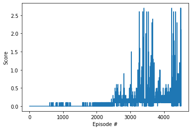

# Project 3: Collaboration and Competition

The approach is to solve the problem using MADDPG algorithm, using separate Actor and Critic for each agents with a shared memory. 

## Model Architecture:
The model consists of 3 Dense layer of size [128, 128, 2].

The Group class is responsible for handling multiple agents.

The environment was solved in 4500 episodes. 

The following is the plot of scores achieved:

## Hyperparameters:
* Buffer size = 100000
* Batch size = 256
* Gamma = 0.9
* Learning Rate Actor = 0.001
* Learning Rate Critic = 0.001

## Next Steps:
* Tweak the Hyperparameters
* Compare other MADDPG variants like shared actors and shared critics
* Try the approach in the Socer environment
* Research stabilization techniques
